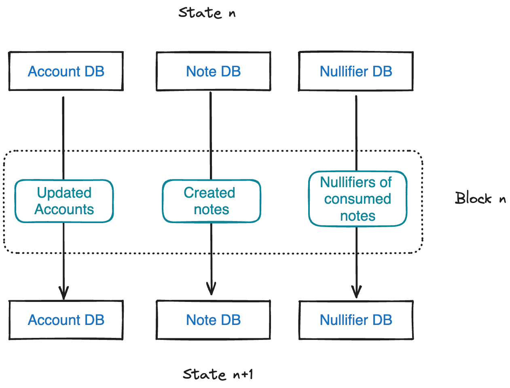
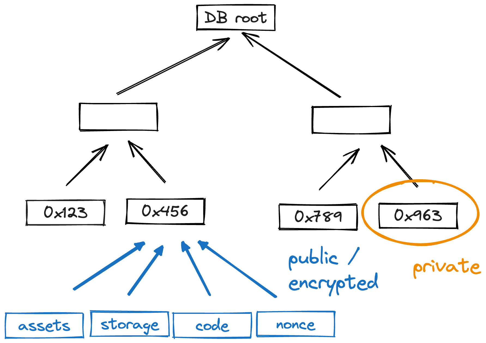
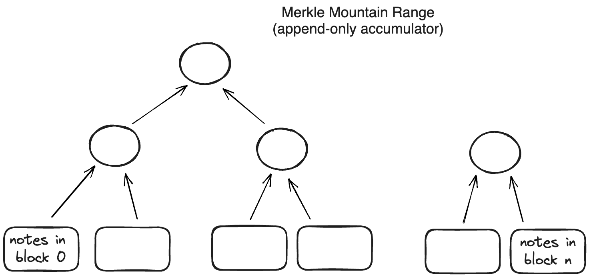
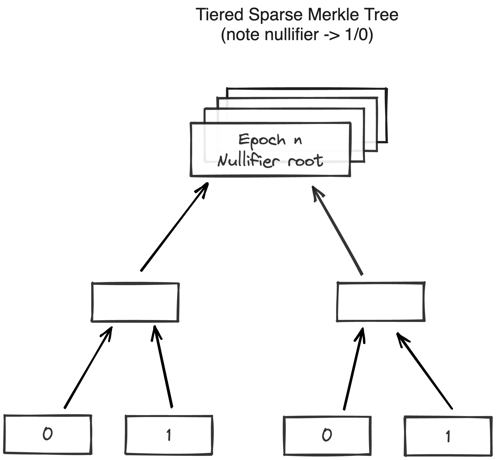

The state of the Miden rollup describes the current condition of all accounts and note states. It describes what is currently the case. With its state model, using concurrent off-chain state, Polygon Miden aims to realize private transactions, and execution and state bloat minimization.

Privacy is realized from a UTXO-like state model consisting of notes and nullifiers combined with off-chain execution using zero-knowledge proofs. Execution bloat happens when transactions get re-executed by all participants of the network. State bloat describes the ever growing state stored in blockchain nodes. Polygon Miden addresses these challenges via its state model that enables concurrent off-chain execution and off-chain storage.

| | Minimize execution bloat | Minimize state bloat |
|---|---|---|
| **Result of** | Verifying state by re-executing | Storing all data onchain as state |
| **Zero-knowledge helps with** | Transactions executed only once | No need to know full state to validate blocks |
| **Concurrent state model helps with** | Transactions executed concurrently by distinct actors | No need to kow full state to produce blocks |

## State components

The Miden Node(s) maintain three databases to describe the state:

1. A database of accounts.
2. A database of notes.
3. A database of nullifiers for already consumed notes.

{ width="80%" }

These databases are represented by authenticated data structures, such that we can easily prove that items were added to or removed from a database, and a commitment to the database would be very small.

Polygon Miden has two databases to capture the note states. The note database is append-only and stores all notes permanently. The nullifier database stores nullifiers that indicate that a note has been previously consumed. Separating note storage into these two databases gives Polygon Miden client-side proving and advanced privacy.

### Account database

The latest account states - and data for onchain accounts - are recorded in a [tiered sparse Merkle tree](../concepts/crypto-primitives/tsmt.md) which maps account IDs to account hashes and account data if needed.

{ width="80%" }

As described in [Accounts](accounts.md#account-storage-modes), there are three types of accounts:

* **Public accounts** where all account data is stored onchain.
* **Encrypted accounts** where where the account data is stored onchain but in encrypted text.
* **Private accounts** where only the hashes of accounts are stored onchain.

Private accounts significantly reduce the storage overhead for nodes. A private account contributes only $40$ bytes to the global state ($8$ bytes account ID + $32$ bytes account hash). Or, said another way, 1 billion private accounts takes up only $40$ GB of state.

!!! info
    Losing the state of a private account would mean loss of funds (as the user won't be able to execute transactions) in a similar manner as a loss of a private key would. This problem can be easily mitigated by storing encrypted account state in a cloud or backing it up somewhere else. Unlike storing private keys in the cloud, this does not compromise privacy or security of an account.

### Note database

Notes are recorded in an append-only accumulator, a [Merkle Mountain Range](https://github.com/opentimestamps/opentimestamps-server/blob/master/doc/merkle-mountain-range.md). Each leaf is a block header which contains the commitment to all notes created in that block. The size of the Merkle Mountain Range grows logarithmically with the number of items in it.

{ width="80%" }

As described in [Notes](notes.md#note-storage-modes), there are two types of [notes](notes.md):

* **Public notes** where the entire note content is recorded in the state.
* **Private notes** where only a note's hash is recorded in the state.

As with accounts, there is a strong incentive to use private notes as they result in lower fees. This is also beneficial to the network as a private note adds only $64$ bytes to the state ($32$ bytes when it is produced, and $32$ bytes when it is consumed).

Using a Merkle Mountain Range (append-only accumulator) is important for two reasons:

1. Membership witnesses (a note exists in the database) against such an accumulator needs to be updated very infrequently.
2. Old membership witnesses can be extended to be used with a new accumulator value, but this extension does not need to be done by the original witness holder.

Both of these properties are needed for supporting local transactions using client-side proofs and privacy. In an append-only data structure, this witness data does not become stale when the data structure is updated. That means users can generate valid proofs even if they don’t have the latest state of this database, so there is no need to query the operator on a constantly changing state.

However, the size of the note database does not grow indefinitely. Theoretically, at high tps, it would grow very quickly: at $1$K TPS there would be about $1$TB/year added to the database. But, only the unconsumed public notes and enough info to construct membership proofs against them need to be stored explicitly. Private notes, as well as public notes which have already been consumed, can be safely discarded. Such notes would still remain in the accumulator, but there is no need to store them explicitly as the append-only accumulator can be updated without knowing all items stored in it. This reduces actual storage requirements to a fraction of the database's nominal size.

### Nullifier database

Nullifiers are stored in a [Tiered Sparse Merkle Tree](../concepts/crypto-primitives/tsmt.md), which maps [Note Nullifiers](notes.md#note-nullifier) to `0` or `1`. Nullifiers provide information on whether a specific note has been consumed yet. The database allows proving that a given nullifier is not in the database.

{ width="80%" }

To prove that a note has not been consumed previously, the operator needs to provide a Merkle path to its node, and then show that the value in that node is `0`. In our case nullifiers are $32$ bytes each, and thus, the height of the Sparse Merkle tree need to be $256$.

To be able to add new nullifiers to the database, Operators needs to maintain the entire nullifier set. Otherwise, they would not be able to compute the new root of the tree.

*Note: Nullifiers as constructed in Miden break linkability of privately stored notes and the information about the note's consumption. To know the [note's nullifier](notes.md#note-nullifier) one must know the note's data.

There will be one tree per epoch (~3 months), and Miden nodes always store trees for at least two epochs. However, the roots of the old trees are still stored. If a user wants to consume a note that is more than $6$ month old, there must be a merkle path provided to the Miden Node for verification.

## State bloat minimization

Operators don’t need to know the entire state to verify or produce a new block. No operator is required to store the entire state.

At its core, the idea is simple: Instead of storing the full state data with the operators, the users store their data, and the rollup only keeps track of commitments to the data. At least for private accounts, some smart contracts need to be publicly visible. This minimizes state bloat—as the operator doesn’t need to store an ever-growing database—and provides privacy because all other users and the operator only see a hash of other users’ data.

That way the account and note databases can remain manageable, even at high usage for extended periods of time.
