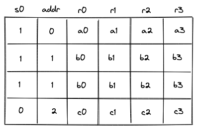

The kernel ROM enables executing predefined kernel procedures. These procedures are always executed in the root context and can only be accessed by a `SYSCALL` operation. The chiplet tracks and enforces correctness of all kernel procedure calls as well as maintaining a list of all the procedures defined for the kernel, whether they are executed or not. More background about Miden VM execution contexts can be found [here](../../specification/assembly/execution-contexts.md).

## Kernel ROM trace

The kernel ROM table consists of 6 columns.

The meaning of columns in the above is as follows:

- Column $s_0$ specifies whether the value in the row should be included into the chiplets bus $b_{chip}$.
- $addr$ is a row address column which starts out at $0$ and must either remain the same or be incremented by $1$ with every row.
- $r_0, ..., r_3$ are contain the roots of the kernel functions. The values in these columns can change only when the value in the $addr$ column changes. If the $addr$ column remains the same, the values in the $r$ columns must also remain the same.

## Constraints

The following constraints are required to enforce correctness of the kernel ROM trace.

For convenience, let's define $\Delta addr = addr' - addr$.

The $s_0$ column must be binary.

> $$
s_0^2 - s_0 = 0 \text{ | degree} = 2
$$

The value in the $addr$ column must either stay the same or increase by $1$.

> $$
\Delta addr \cdot (1 - \Delta addr) = 0 \text{ | degree} = 2
$$

Finally, if the $addr$ column stays the same then the kernel procedure root must not change. This can be achieved by enforcing the following constraint against each of the four procedure root columns:

> $$
(1 - \Delta addr) \cdot (r_i' - r_i) = 0 \text{ | degree} = 2
$$

These constraints on $addr$ should not be applied to the very last row of the kernel ROM's execution trace, since we do not want to enforce a value that would conflict with the first row of a subsequent chiplet (or padding). Therefore we can create a special virtual flag for this constraint using the $chip\_s_3$ selector column from the [chiplets](index.md) module that selects for the kernel ROM chiplet.

The modified constraints which should be applied are the following:

>$$
(1 - chip\_s_3') \cdot \Delta addr \cdot (1 - \Delta addr) = 0 \text{ | degree} = 3
$$

>$$
(1 - chip\_s_3') \cdot (1 - \Delta addr) \cdot (r_i' - r_i) = 0 \text{ | degree} = 3
$$

!!! note
    These constraints should also be multiplied by chiplets module's selector flag for the kernel ROM chiplet, as is true for all constraints in this chiplet._

## Chiplets bus constraints

The chiplets bus is used to keep track of all kernel function calls. To simplify the notation for describing kernel ROM constraints on the chiplets bus, we'll first define variable $u$, which represents how each kernel procedure in the kernel ROM's execution trace is reduced to a single value. Denoting the random values received from the verifier as $\alpha_0, \alpha_1$, etc., this can be achieved as follows.

$$
v = \alpha_0 + \alpha_1 \cdot op_{krom} + \sum_{i=0}^3 (\alpha_{i + 2} \cdot r_i)
$$

Where, $op_{krom}$ is the unique [operation label](./index.md#operation-labels) of the kernel procedure call operation.

The request side of the constraint for the operation is enforced during program block hashing of the [`SYSCALL` operation](../decoder/constraints.md#block-hash-computation-constraints).

To provide accessed kernel procedures to the chiplets bus, we must send the kernel procedure to the bus every time it is called, which is indicated by the $s_0$ column.

> $$
b'_{chip} = b_{chip} \cdot (s_0 \cdot v + 1 - s_0) \text{ | degree} = 3
$$

Thus, when $s_0 = 0$ this reduces to $b'_{chip} = b_{chip}$, but when $s_0=1$ it becomes $b'_{chip} = b_{chip} \cdot u$.

## Kernel procedure table constraints

!!! note
    Although this table is described independently, it is implemented as part of the [chiplets virtual table](../chiplets/index.md#chiplets-virtual-table), which combines all virtual tables required by the any of the chiplets into a single master table.*

This kernel procedure table keeps track of all *unique* kernel function roots. The values in this table will be updated only when the value in the address column changes.

The row value included into $vt_{chip}$ is:

$$
v = \alpha_0 + \alpha_1 \cdot addr + \sum_{i=0}^3 (\alpha_{i + 2} \cdot r_i)
$$

The constraint against $vt_{chip}$ is:

> $$
vt_{chip}' = vt_{chip} \cdot (\Delta addr \cdot v + 1 - \Delta addr) \text{ | degree} = 3
$$

Thus, when $\Delta addr = 0$, the above reduces to $vt'_{chip}=vt_{chip}$, but when $\Delta addr = 1$, the above becomes $vt'_{chip} = vt_{chip} \cdot v$.

We also need to impose boundary constraints to make sure that running product column implementing the kernel procedure table is equal to $1$ when the kernel procedure table begins and to the product of all unique kernel functions when it ends. The last boundary constraint means that the verifier only needs to know which kernel was used, but doesn't need to know which functions were invoked within the kernel. These two constraints are described as part of the [chiplets virtual table constraints](../chiplets/index.md#chiplets-virtual-table-constraints).