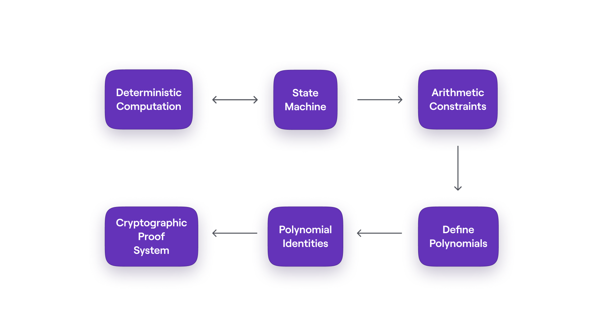

## Introduction

This document gives a short summary of the **Multiplicative Fibonacci State Machine**, presented as a simple model for the zkProver State Machines. As already mentioned in preceding sections, the overall design of the Polygon zkEVM follows the State Machine model, and thus emulates the Ethereum Virtual Machine (EVM).

The computations involved in Ethereum, such as; making payments, transferring ERC20 tokens and running smart contracts; are repeatedly carried out and are all deterministic. That is, a particular input always produces the same output. Unlike the arithmetic circuit model which would need loops to be unrolled and hence resulting in undesirably larger circuits, the **State Machine** model is most suitable for iterative and deterministic computations.

## zkProver's state machine design

In order to break down the complexity of the zkProver's design, we use a simplified **Hello World** example, in particular the multiplicative Fibonacci State Machine (or mFibonacci SM). This simple State Machine helps us to illustrate, in a generic sense, how the State Machine approach has been implemented to realize the zkProver.

!!!info
    Computing consecutive members of the well-known Fibonacci series, starting with specific initial values, is a deterministic computation.

Consider a scenario where a party called the prover needs to prove knowledge of the initial values of the Fibonacci series that produced a given N-th value of the series, in a verifiable manner.

These types of computations form a perfect analogy of what the zkProver has to do. That is, to produce verifiable proofs that attest to the validity of the transactions submitted to the Ethereum blockchain.

The approach taken, is that of developing a State Machine that allows a prover to create and submit a verifiable proof of knowledge, and anyone can take such a proof to verify its validity.

The process that leads to achieving such a State Machine-based system takes a few steps;

- Modelling the deterministic computation involved as a State Machine
- Stating the equations that fully describe the state transitions of the State Machine, called Arithmetic Constraints
- Using established and efficient Mathematical methods to define the corresponding polynomials
- Expressing the previously stated Arithmetic Constraints into their equivalent Polynomial Identities.

These Polynomial Identities are equations that can be easily tested in order to verify the prover's claims. A so-called Commitment Scheme is required for facilitating the proving and the verification. Hence, in the zkProver context, a proof/verification scheme called PIL-STARK is used.

The Multiplicative Fibonacci SM document culminates in a DIY guide to implementing the proving and verification of the mFibonacci State Machine.
